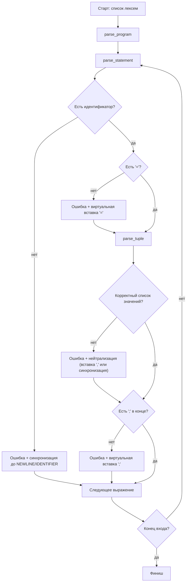
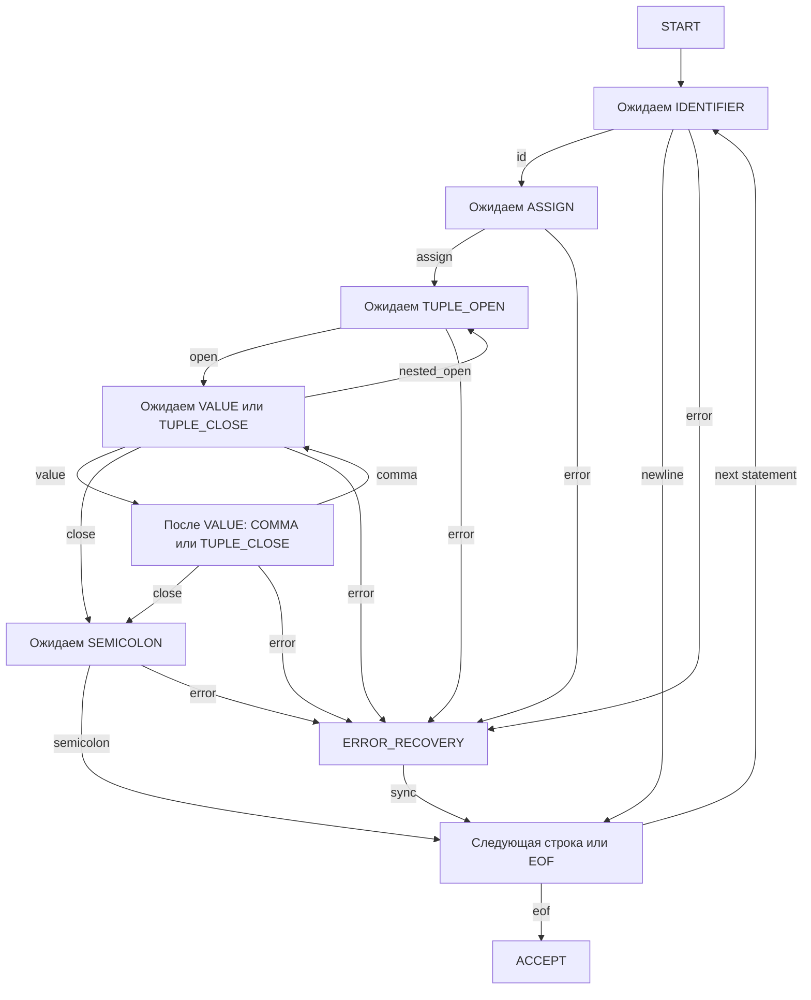
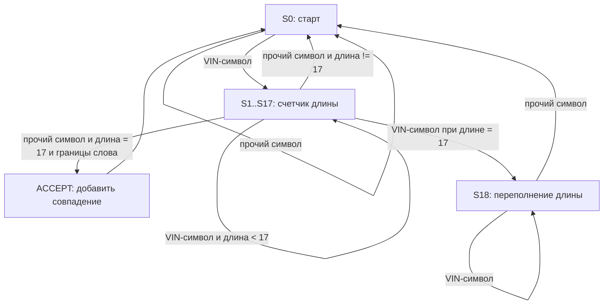
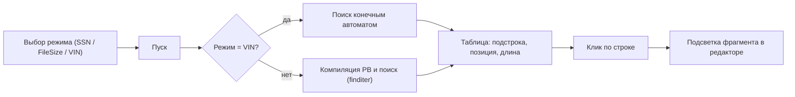
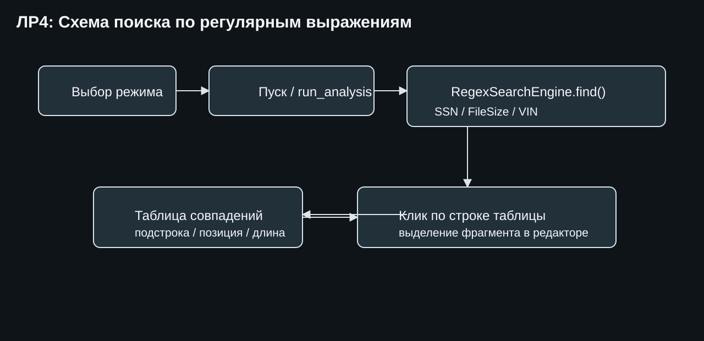

# Языковой процессор: ЛР1-ЛР4 (единый README)

## Сведения об авторе
Андрей.

## Лабораторная работа 1. GUI для языкового процессора

### Название и цель
**Название:** разработка графического интерфейса языкового процессора.  
**Цель:** создать кроссплатформенный текстовый редактор с меню, панелью инструментов, вкладками редактора и областью вывода результатов.

### Постановка задачи
Разработать desktop-приложение с базовыми операциями редактора, пунктами меню и подготовленной областью для вывода результатов работы языкового процессора.

### Реализовано
- меню `Файл/Правка/Текст/Справка/Язык/Вид`;
- панели инструментов;
- вкладки редактора, нумерация строк, подсветка синтаксиса;
- вкладки области вывода;
- горячие клавиши и drag-and-drop открытия файлов.

### Скриншот интерфейса


---

## Лабораторная работа 2. Лексический анализатор

### Название и цель
**Название:** разработка лексического анализатора (сканера).  
**Цель:** спроектировать конечный автомат и реализовать выделение лексем для варианта “объявление кортежа на языке Elixir” (с учебным требованием `;` в конце строки).

### Постановка задачи
Реализовать сканер, который принимает многострочный текст, выделяет допустимые лексемы, определяет позиции и помечает недопустимые символы как ошибки.

### Вариант и допустимые лексемы
Типовая конструкция:
```elixir
identifier = {element1, element2, ...};
```

| Код | Тип лексемы | Пример |
|---:|---|---|
| 1 | целое без знака | `42` |
| 2 | идентификатор | `tuple` |
| 3 | атом | `:ok` |
| 4 | строковый литерал | `"Hello"` |
| 10 | оператор присваивания | `=` |
| 11 | разделитель (запятая) | `,` |
| 12 | разделитель (открывающая скобка кортежа) | `{` |
| 13 | разделитель (закрывающая скобка кортежа) | `}` |
| 14 | разделитель (пробел/табуляция) | `(пробел)` |
| 15 | разделитель (перенос строки) | `\n` |
| 16 | конец оператора | `;` |
| 99 | ошибка | недопустимый символ |

### Диаграмма лексера


Дополнительно в проекте: `docs/lexer-diagram.drawio`.

### Тестовые примеры (ЛР2)
- Корректная строка: `person = {:user, "Andrey", 21};`
- Недопустимый символ: `person = {:user, @};`
- Многострочный пример:
```elixir
first = {:ok, 1};
second = {:error, "bad"};
```

---

## Лабораторная работа 3. Синтаксический анализатор

### Название и цель
**Название:** разработка синтаксического анализатора (парсера).  
**Цель:** спроектировать грамматику, реализовать синтаксический анализ и нейтрализацию ошибок методом Айронса.

### Постановка задачи
Реализовать парсер для объявления кортежа, встроить его в GUI и вывести таблицу синтаксических ошибок с переходом курсора к ошибке.

### Разработка грамматики
```text
<program>   -> <nl>* <stmt_list> <nl>*
<stmt_list> -> <stmt> (<nl>+ <stmt>)*
<stmt>      -> <id> '=' <tuple> ';'
<tuple>     -> '{' <elems_opt> '}'
<elems_opt> -> ε | <elems>
<elems>     -> <value> (',' <value>)*
<value>     -> <id> | <atom> | <int> | <string> | <tuple>
<nl>        -> '\n'
```

### Классификация грамматики
Контекстно-свободная грамматика (тип 2 по Хомскому).

### Метод анализа
Рекурсивный спуск: `parse_program`, `parse_statement`, `parse_tuple`, `parse_value`.

### Диагностика и нейтрализация (метод Айронса)
- анализ не останавливается после первой ошибки;
- локальные коррекции: виртуальная вставка пропущенных `=`, `,`, `;`;
- синхронизация по опорным токенам (`NEWLINE`, `IDENTIFIER`, `,`, `}`), чтобы продолжить разбор.

### Схема парсера


### Схема автомата (состояния парсера)


### Тестовые примеры (ЛР3)
- Корректная: `tuple = {:ok, "Hello", 42};`
- Одна ошибка: `tuple = {:ok "Hello", 42};` (нет запятой)
- Несколько ошибок:
```elixir
tuple = {:ok "Hello" 42
next = {:bad, };
```
- Пустая строка
- Без первого идентификатора: `= {:ok, 1};`

---

## Лабораторная работа 4. Поиск подстрок по регулярным выражениям

### Название и цель
**Название:** реализация поиска подстрок по регулярным выражениям.  
**Цель:** изучить РВ и интегрировать поиск в GUI с табличным выводом и подсветкой совпадений.

### Постановка задачи
Реализовать 3 индивидуальных задания поиска, добавить выбор режима поиска в интерфейс и таблицу результатов:
- найденная подстрока;
- начальная позиция (строка, символ);
- длина.

### Вариант: 3 задания
1. SSN: формат `XXX-XX-XXXX`.
2. Размеры файлов: число + `KB/MB/GB/TB`.
3. VIN: 17 символов, без `I`, `O`, `Q`.

### Решение задач (РВ)

#### Задача 1: SSN
```regex
(?<!\d)\d{3}-\d{2}-\d{4}(?!\d)
```
- Найдет: `123-45-6789`
- Не найдет: `123456789`, `12-345-6789`

#### Задача 2: Размеры файлов
```regex
(?<![\w.])\d+(?:\.\d+)?(?:KB|MB|GB|TB)\b
```
- Найдет: `10KB`, `1.5GB`, `256MB`
- Не найдет: `12PB`, `GB`, `1,5GB`

#### Задача 3: VIN
```regex
\b[A-HJ-NPR-Z0-9]{17}\b
```
- Найдет: `1HGCM82633A004352`
- Не найдет: `1HGCM82633A00I352`, `1HGCM82633A00435`

### Доп. задание: автоматный поиск (блок 3, VIN)
Для задания `VIN` дополнительно реализован поиск не через `Regex`, а через конечный автомат в коде:
- `src/main.py` -> `RegexSearchEngine._find_vin_by_automaton()`.

Условие символа `VIN`: `[A-HJ-NPR-Z0-9]` (без `I`, `O`, `Q`, регистр не учитывается).

Граф автомата (укрупненно):


Тестовый пример для автоматного поиска:
```text
VIN: 1HGCM82633A004352
bad: 1HGCM82633A00I352
mix: X1HGCM82633A004352Y
ok2: jh4tb2h26cc000000
```

Результаты автомата (с местоположением):

| Найденная подстрока | Местоположение | Длина | Комментарий |
|---|---|---:|---|
| `1HGCM82633A004352` | строка 1, позиция 6 | 17 | корректный VIN |
| `jh4tb2h26cc000000` | строка 4, позиция 6 | 17 | корректный VIN, lowercase |

Примеры, которые автомат не должен находить:
- `1HGCM82633A00I352` (содержит недопустимый символ `I`);
- `X1HGCM82633A004352Y` (нет границ слова слева/справа).

### Схема РВ-поиска




### Тестовые примеры (ЛР4)
Тестовый текст:
```text
User SSN: 123-45-6789
Backup size: 1.5GB and 256MB
VIN: 1HGCM82633A004352
Invalid: 12-345-6789, 12PB, 1HGCM82633A00I352
```

Ожидаемые совпадения:
- SSN: `123-45-6789`
- Размеры файлов: `1.5GB`, `256MB`
- VIN: `1HGCM82633A004352`

---

## Интеграция в интерфейс (итог ЛР1-ЛР4)

Режимы в выпадающем списке на панели инструментов:
- `Синтаксический анализ (ЛР3)`
- `РВ 1: SSN`
- `РВ 2: Размеры файлов`
- `РВ 3: VIN`

Поведение кнопки `Пуск`:
- в режиме ЛР3: лексический + синтаксический анализ;
- в режимах ЛР4: поиск совпадений по выбранному РВ.

Таблицы вывода:
- `Лексемы`;
- `Синтаксис`;
- `РВ-поиск`.

Навигация:
- клик по ошибке или совпадению переносит курсор к нужной позиции;
- для РВ-поиска найденный фрагмент выделяется в редакторе.

Для пустого текста в режиме РВ выводится: `Нет данных для поиска`.

---

## Запуск
1. Установить зависимости:
```bash
pip install -r requirements.txt
```
2. Запустить приложение:
```bash
python3 src/main.py
```
3. Выбрать нужный режим анализа и нажать `Пуск`.


