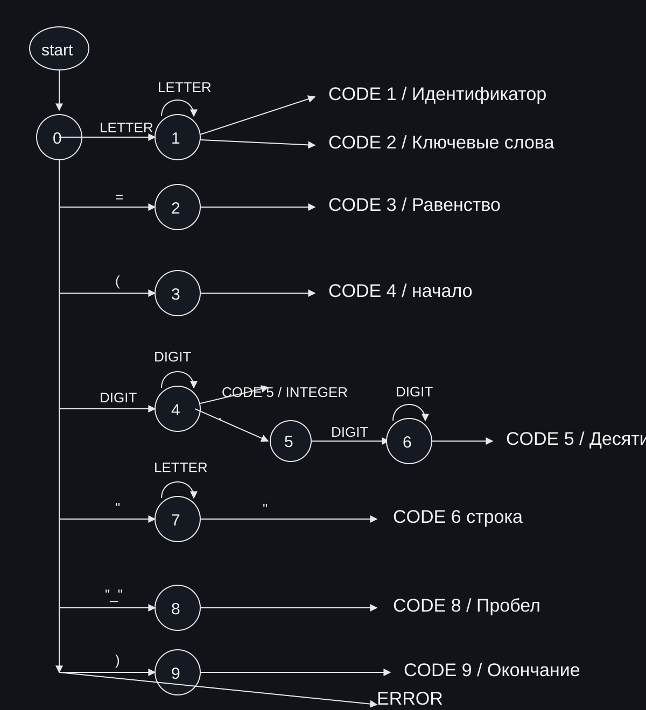

# Лабораторная работа 2. Разработка лексического анализатора

## Название и цель лабораторной работы
**Название:** разработка лексического анализатора (сканера) и интеграция в GUI языкового процессора.  
**Цель:** изучить назначение лексического анализатора, спроектировать конечный автомат, реализовать сканер и встроить его в интерфейс из ЛР1.

## Сведения об авторе
Андрей.

## Постановка задачи
Реализовать лексический анализатор для индивидуального варианта и подключить его к команде `Пуск` (кнопка панели инструментов и пункт меню).  
Сканер принимает многострочный текст, выделяет лексемы, классифицирует их по типам и выводит результат в таблицу с позициями.  
Недопустимые символы помечаются как ошибки с указанием места в тексте.

## Вариант задания
**Вариант:** объявление кортежа на языке Elixir.

Типовой шаблон входной конструкции:
```elixir
identifier = {element1, element2, ...}
```

### Примеры корректных входных строк
1. `person = {:user, "Andrey", 21}`
2. `coords = {10, 20, 30}`
3. `status = {:ok, 200}`

### Перечень допустимых лексем

| Код | Тип лексемы | Пример | Комментарий |
|---:|---|---|---|
| 1 | целое без знака | `21` | последовательность цифр `0-9` |
| 2 | идентификатор | `person` | `[a-z_][a-z0-9_]*` |
| 3 | атом | `:ok` | `:` + имя атома (`[a-z_][a-z0-9_]*`) |
| 4 | строковый литерал | `"Andrey"` | строка в двойных кавычках |
| 10 | оператор присваивания | `=` | одиночный символ |
| 11 | разделитель (запятая) | `,` | разделение элементов кортежа |
| 12 | разделитель (открывающая скобка кортежа) | `{` | начало кортежа |
| 13 | разделитель (закрывающая скобка кортежа) | `}` | конец кортежа |
| 14 | разделитель (пробел/табуляция) | `(пробел)` | последовательность ` ` / `\t` / `\r` |
| 15 | разделитель (перенос строки) | `(перенос строки)` | символ `\n` |
| 99 | ошибка | `@` | недопустимый символ или незавершенная строка |

## Диаграмма состояний


```mermaid
stateDiagram-v2
    [*] --> START

    START --> WS: пробел / \t / \r
    WS --> WS: пробел / \t / \r
    WS --> START: emit WHITESPACE

    START --> NL: \n
    NL --> START: emit NEWLINE

    START --> IDENT: [a-z_]
    IDENT --> IDENT: [a-z0-9_]
    IDENT --> START: emit IDENTIFIER

    START --> INT: [0-9]
    INT --> INT: [0-9]
    INT --> START: emit INTEGER

    START --> COLON: :
    COLON --> ATOM: [a-z_]
    COLON --> ERROR: иначе
    ATOM --> ATOM: [a-z0-9_]
    ATOM --> START: emit ATOM

    START --> STRING: "
    STRING --> ESC: \\
    ESC --> STRING: любой символ
    STRING --> START: '"' / emit STRING
    STRING --> ERROR: \n или EOF

    START --> START: '=' ',' '{' '}' / emit single-char token
    START --> ERROR: прочий символ
    ERROR --> START: emit ERROR
```

Кратко о работе автомата:
- В состоянии `START` выбирается тип текущей лексемы по первому символу.
- Для многосимвольных токенов (`IDENT`, `INT`, `ATOM`, `STRING`, `WS`) автомат остается в состоянии, пока символы соответствуют классу.
- При встрече недопустимого символа или незакрытой строки формируется лексема типа `ошибка`.

## Интеграция в интерфейс
- Запуск анализа выполняется методом `run_analysis`, который вызывается и кнопкой `Пуск`, и одноименным пунктом меню.
- Результат выводится в табличную вкладку с колонками: `Код`, `Тип лексемы`, `Лексема`, `Местоположение`.
- При щелчке по строке-ошибке курсор редактора переводится к позиции проблемного символа.
- Перед новым запуском старые результаты очищаются.

## Тестовые примеры

### 1. Корректная строка
**Вход:**
```elixir
person = {:user, "Andrey", 21}
```

**Выход (фрагмент таблицы):**

| Код | Тип лексемы | Лексема | Местоположение |
|---:|---|---|---|
| 2 | идентификатор | `person` | строка 1, 1-6 |
| 14 | разделитель (пробел/табуляция) | `(пробел)` | строка 1, 7-7 |
| 10 | оператор присваивания | `=` | строка 1, 8-8 |
| 14 | разделитель (пробел/табуляция) | `(пробел)` | строка 1, 9-9 |
| 12 | разделитель (открывающая скобка кортежа) | `{` | строка 1, 10-10 |
| 3 | атом | `:user` | строка 1, 11-15 |
| 11 | разделитель (запятая) | `,` | строка 1, 16-16 |
| 14 | разделитель (пробел/табуляция) | `(пробел)` | строка 1, 17-17 |
| 4 | строковый литерал | `"Andrey"` | строка 1, 18-25 |
| 11 | разделитель (запятая) | `,` | строка 1, 26-26 |
| 14 | разделитель (пробел/табуляция) | `(пробел)` | строка 1, 27-27 |
| 1 | целое без знака | `21` | строка 1, 28-29 |
| 13 | разделитель (закрывающая скобка кортежа) | `}` | строка 1, 30-30 |

### 2. Строка с недопустимым символом
**Вход:**
```elixir
person = {:user, @}
```

**Выход (фрагмент таблицы):**

| Код | Тип лексемы | Лексема | Местоположение |
|---:|---|---|---|
| 2 | идентификатор | `person` | строка 1, 1-6 |
| 10 | оператор присваивания | `=` | строка 1, 8-8 |
| 12 | разделитель (открывающая скобка кортежа) | `{` | строка 1, 10-10 |
| 3 | атом | `:user` | строка 1, 11-15 |
| 11 | разделитель (запятая) | `,` | строка 1, 16-16 |
| 99 | ошибка: недопустимый символ `'@'` | `@` | строка 1, 18-18 |
| 13 | разделитель (закрывающая скобка кортежа) | `}` | строка 1, 19-19 |

### 3. Многострочный пример
**Вход:**
```elixir
first = {:ok, 1}
second = {:error, "bad"}
```

**Выход (ключевые строки таблицы):**

| Код | Тип лексемы | Лексема | Местоположение |
|---:|---|---|---|
| 2 | идентификатор | `first` | строка 1, 1-5 |
| 3 | атом | `:ok` | строка 1, 10-12 |
| 1 | целое без знака | `1` | строка 1, 15-15 |
| 15 | разделитель (перенос строки) | `(перенос строки)` | строка 1, 17-17 |
| 2 | идентификатор | `second` | строка 2, 1-6 |
| 3 | атом | `:error` | строка 2, 11-16 |
| 4 | строковый литерал | `"bad"` | строка 2, 19-23 |

## Запуск
1. Установить зависимости: `pip install -r requirements.txt`
2. Запустить приложение: `python3 src/main.py`
3. Ввести текст и нажать `Пуск`.
