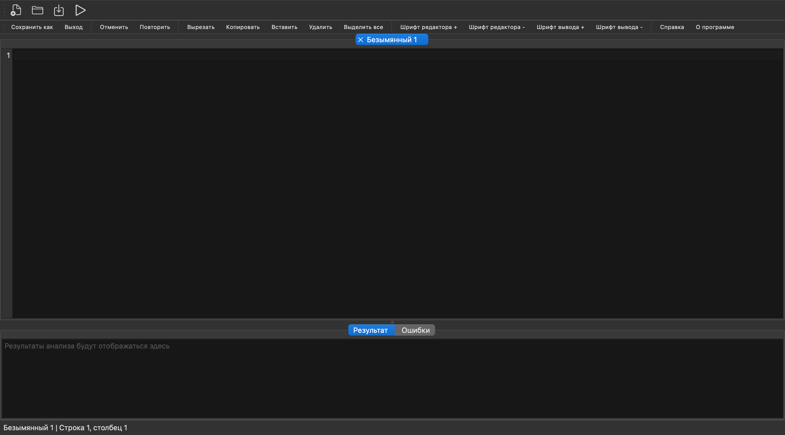

# Лабораторная работа 3. Разработка синтаксического анализатора (парсера)

## Название и цель лабораторной работы
**Название:** разработка синтаксического анализатора и интеграция в GUI языкового процессора.  
**Цель:** изучить назначение синтаксического анализатора, спроектировать грамматику, реализовать парсер и нейтрализацию ошибок методом Айронса, встроить модуль в интерфейс из ЛР1.

## Сведения об авторе
Андрей.

## Постановка задачи
Разработать парсер для индивидуального варианта, встроить его в приложение и обеспечить наглядный вывод результатов.  
Кнопка `Пуск` должна запускать сначала лексический анализ (ЛР2), затем синтаксический анализ (ЛР3).  
При ошибках необходимо показывать таблицу синтаксических ошибок и общее количество найденных ошибок, а также поддержать переход курсора к ошибочному фрагменту по клику в таблице.

## Вариант задания
**Вариант:** объявление кортежа на языке Elixir.

Типовой вид конструкции:
```elixir
identifier = {element1, element2, ...};
```

### Примеры корректных входных строк
1. `tuple = {:ok, "Hello", 42};`
2. `person = {:user, "Andrey", 21};`
3. `coords = {10, 20, 30};`

### Перечень допустимых лексем

| Код | Тип лексемы | Пример |
|---:|---|---|
| 1 | целое без знака | `42` |
| 2 | идентификатор | `tuple` |
| 3 | атом | `:ok` |
| 4 | строковый литерал | `"Hello"` |
| 10 | оператор присваивания | `=` |
| 11 | разделитель (запятая) | `,` |
| 12 | разделитель (открывающая скобка кортежа) | `{` |
| 13 | разделитель (закрывающая скобка кортежа) | `}` |
| 14 | разделитель (пробел/табуляция) | `(пробел)` |
| 15 | разделитель (перенос строки) | `\n` |
| 16 | конец оператора | `;` |
| 99 | ошибка | недопустимый символ |

## Диаграмма лексера


Исходник диаграммы (draw.io): [docs/lexer-diagram.drawio](docs/lexer-diagram.drawio)

## Разработка грамматики
Используемая КС-грамматика `G[Z]` для синтаксической конструкции:

```text
<program>   -> <nl>* <stmt_list> <nl>*
<stmt_list> -> <stmt> (<nl>+ <stmt>)*
<stmt>      -> <id> '=' <tuple> ';'
<tuple>     -> '{' <elems_opt> '}'
<elems_opt> -> ε | <elems>
<elems>     -> <value> (',' <value>)*
<value>     -> <id> | <atom> | <int> | <string> | <tuple>
<nl>        -> '\n'
```

Грамматика допускает вложенные кортежи (правило `<value> -> <tuple>`).

## Классификация грамматики
Грамматика относится к **контекстно-свободным** (тип 2 по Хомскому):
- слева в каждом правиле ровно один нетерминал;
- присутствует рекурсия (`<value> -> <tuple>`), поэтому язык в общем случае не является регулярным.

## Метод анализа
Применен **рекурсивный спуск**. Реализованы процедуры:
- `parse_program` — разбор всего входа и разделение объявлений по строкам;
- `parse_statement` — разбор `identifier = tuple ;`;
- `parse_tuple` — разбор `{ ... }` и списка элементов;
- `parse_value` — разбор элемента кортежа.

Схема анализа:

```mermaid
flowchart TD
    A[Старт: получить лексемы] --> B[parse_program]
    B --> C[parse_statement]
    C --> D{ID?}
    D -- нет --> E[Ошибка + синхронизация]
    D -- да --> F{= ?}
    F -- нет --> G[Ошибка + виртуальная вставка '=']
    F -- да --> H[parse_tuple]
    G --> H
    H --> I{{'{' ?}}
    I -- нет --> J[Ошибка + попытка продолжить]
    I -- да --> K[parse_value / список через ',']
    K --> L{{'}' ?}}
    L -- нет --> M[Ошибка + синхронизация]
    L -- да --> N[Следующее выражение / конец]
    E --> N
    J --> N
    M --> N
```

## Диагностика и нейтрализация синтаксических ошибок
Для нейтрализации используется подход метода Айронса:
- анализ **не останавливается** после первой ошибки;
- выполняются локальные коррекции:
  - виртуальная вставка пропущенного `=` после идентификатора;
  - виртуальная вставка пропущенной `,` между элементами кортежа;
  - виртуальная вставка пропущенного `;` в конце объявления;
- выполняется синхронизация по опорным лексемам:
  - для уровня выражения: `NEWLINE`, `IDENTIFIER`;
  - для уровня кортежа: `,`, `}`, `NEWLINE`.

Это позволяет выявлять несколько ошибок за один проход.

## Интеграция в интерфейс
Реализовано в GUI:
- `Пуск` запускает лексический анализатор, затем синтаксический;
- вкладка `Лексемы` показывает результаты сканера;
- вкладка `Синтаксис` показывает таблицу ошибок со столбцами:
  - `Неверный фрагмент`;
  - `Местоположение`;
  - `Описание`;
- в блоке `Результат` выводятся количества:
  - лексических ошибок;
  - синтаксических ошибок;
  - общее количество ошибок;
- по клику на строке ошибки курсор в редакторе переходит к позиции ошибки.

## Тестовые примеры

### Скриншот интерфейса


### 1. Корректная строка
**Вход:**
```elixir
tuple = {:ok, "Hello", 42};
```
**Ожидаемо:** синтаксических ошибок нет.

### 2. Одна ошибка
**Вход:**
```elixir
tuple = {:ok "Hello", 42};
```
**Диагностика:** пропущена запятая между `:ok` и `"Hello"`.  
**Ошибка в таблице:** `Ожидалась ',' между элементами кортежа`.

### 3. Несколько ошибок
**Вход:**
```elixir
tuple = {:ok "Hello" 42
next = {:bad, };
```
**Примеры ошибок:**
- отсутствуют запятые между элементами;
- пропущена `;` после первой строки;
- не закрыт кортеж на первой строке;
- пропущено значение перед `}` на второй строке.

### 4. Пустая строка
**Вход:** пусто.  
**Ошибка:** `Ожидалось объявление кортежа`.

### 5. Строка без первого идентификатора
**Вход:**
```elixir
= {:ok, 1};
```
**Ошибка:** `Ожидался идентификатор в начале объявления`.

## Запуск
1. Установить зависимости: `pip install -r requirements.txt`
2. Запустить приложение: `python3 src/main.py`
3. Ввести код в редактор и нажать `Пуск`.
