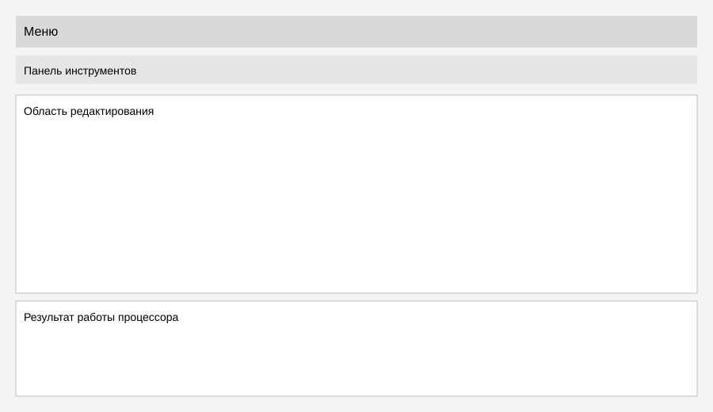

# Лабораторная работа 1. GUI для языкового процессора

## Цель работы
Создание кроссплатформенного графического интерфейса для языкового процессора в виде текстового редактора.

## Автор
Андрей

## Описание проекта
Оконное приложение с меню, панелью инструментов и двумя основными рабочими областями: редактор текста и область вывода результатов. Реализованы вкладки для работы с несколькими текстами и вкладки в области результатов. Подготовлена основа для дальнейшего подключения языкового процессора.

## Используемые технологии
- Язык: Python 3.10-3.13
- GUI: PySide6 (Qt)
- Сборка: PyInstaller
- Среда разработки: любая (проект не привязан к IDE)

## Инструкция по сборке и запуску

### Установка зависимостей
1. `python3 -m venv .venv`
2. `source .venv/bin/activate` (macOS/Linux) или `.venv\Scripts\activate` (Windows)
3. `pip install -r requirements.txt`

Примечание: на Python 3.14 `PySide6` может не устанавливаться. Рекомендуется Python 3.12 или 3.13.

### Запуск в режиме разработки
- `python3 src/main.py`

### Сборка исполняемого файла
PyInstaller собирает бинарник под текущую ОС. Для Windows/macOS/Linux нужно собирать отдельно на каждой системе.

1. `pip install pyinstaller`
2. `pyinstaller --onefile --windowed src/main.py`

Готовый файл появится в `dist/`:
- macOS/Linux: `dist/main`
- Windows: `dist/main.exe`

## Интерфейс и функции

Скриншот интерфейса:

Главные элементы:
- Меню (верхняя строка)
- Панель инструментов (иконки/кнопки)
- Область редактирования (верхняя большая часть, вкладки, нумерация строк)
- Область вывода результатов (нижняя часть, вкладки `Результат` и `Ошибки`)

Функции:
- Файл
  - Новый: меню `Файл` или кнопка на панели, `Ctrl+N` / `Cmd+N`
  - Открыть: меню `Файл` или кнопка на панели, `Ctrl+O` / `Cmd+O`
  - Сохранить: меню `Файл` или кнопка на панели, `Ctrl+S` / `Cmd+S`
  - Сохранить как: меню `Файл` или кнопка на панели, `Ctrl+Shift+S` / `Cmd+Shift+S`
  - Выход: меню `Файл` или кнопка на панели, `Ctrl+Q` / `Cmd+Q`
- Правка
  - Отменить: меню `Правка` или кнопка на панели, `Ctrl+Z` / `Cmd+Z`
  - Повторить: меню `Правка` или кнопка на панели, `Ctrl+Y` / `Cmd+Shift+Z`
  - Вырезать: меню `Правка` или кнопка на панели, `Ctrl+X` / `Cmd+X`
  - Копировать: меню `Правка` или кнопка на панели, `Ctrl+C` / `Cmd+C`
  - Вставить: меню `Правка` или кнопка на панели, `Ctrl+V` / `Cmd+V`
  - Удалить: меню `Правка` или кнопка на панели, `Del`
  - Выделить все: меню `Правка` или кнопка на панели, `Ctrl+A` / `Cmd+A`
- Справка
  - Справка: меню `Справка` или кнопка на панели
  - О программе: меню `Справка` или кнопка на панели
- Текст
  - Постановка задачи: меню `Текст`
  - Грамматика: меню `Текст`
  - Классификация грамматики: меню `Текст`
  - Метод анализа: меню `Текст`
  - Тестовый пример: меню `Текст`
  - Список литературы: меню `Текст`
  - Исходный код программы: меню `Текст`
- Пуск
  - Запуск анализа текста: меню `Пуск` или кнопка на панели, `F5`
- Язык / Language
  - Переключение языка интерфейса (RU/EN): меню `Язык` / `Language`

## Ограничения
- Сохранение выполняется в кодировке UTF-8.
- Сборка PyInstaller требует повторения на каждой целевой ОС.
- Область результата пока не выполняет реальный анализ, используется как задел под будущий процессор.

## Дополнительно реализовано
- Изменение размера текста в окне редактора и окне вывода (`Вид`, горячие клавиши).
- Открытие файла перетаскиванием в окно программы.
- Наличие строки состояния.
- Базовая подсветка синтаксиса в окне редактирования.
- Горячие клавиши для основных команд.
- Меню `Текст` с учебными разделами и просмотром исходного кода программы.
- Команда `Пуск` с базовым анализом текста и выводом результатов в нижнюю область.
- Интерфейс с вкладками для одновременной работы с несколькими текстами.
- Выбор языка интерфейса приложения (RU/EN).
- Нумерация строк в окне редактирования текста.
- Интерфейс с вкладками для разных модулей вывода (`Результат` и `Ошибки`).
- Отображение ошибок в окне вывода результатов в виде таблицы.
