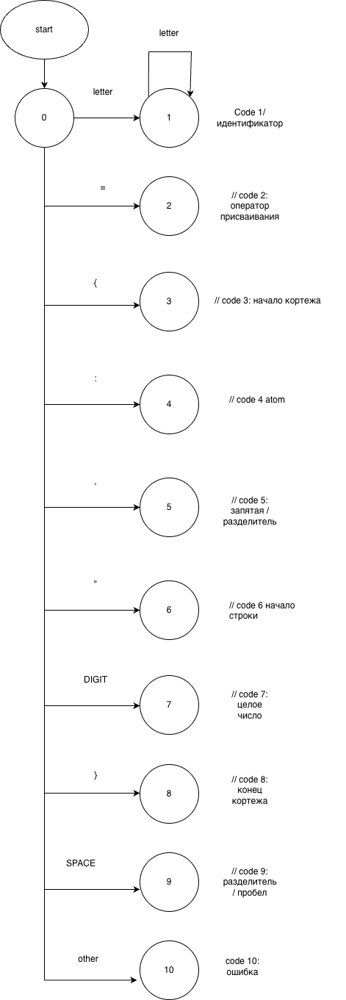
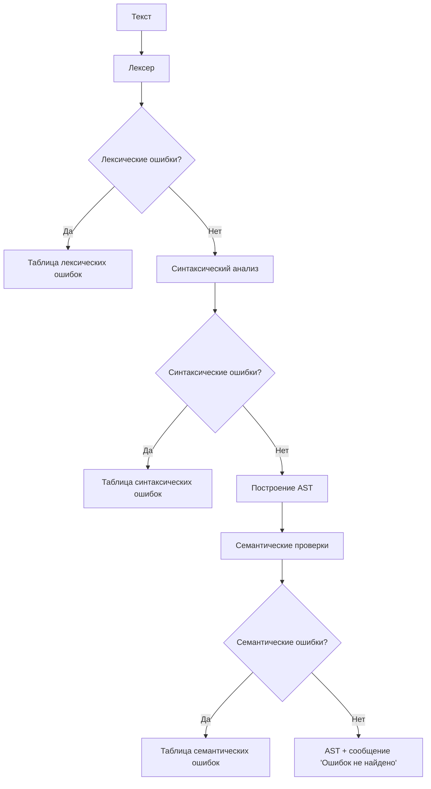
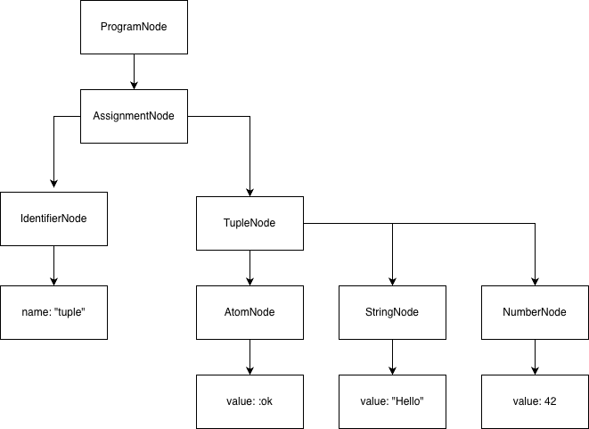

# Языковой процессор: ЛР1-ЛР5 (единый README)

## Сведения об авторе
Андрей.

## Лабораторная работа 1. GUI для языкового процессора

### Название и цель
**Название:** разработка графического интерфейса языкового процессора.  
**Цель:** создать кроссплатформенный текстовый редактор с меню, панелью инструментов, вкладками редактора и областью вывода результатов.

### Постановка задачи
Разработать desktop-приложение с базовыми операциями редактора, пунктами меню и подготовленной областью для вывода результатов работы языкового процессора.

### Реализовано
- меню `Файл/Правка/Текст/Справка/Язык/Вид`;
- панели инструментов;
- вкладки редактора, нумерация строк, подсветка синтаксиса;
- вкладки области вывода;
- горячие клавиши и drag-and-drop открытия файлов.

### Скриншот интерфейса


---

## Лабораторная работа 2. Лексический анализатор

### Название и цель
**Название:** разработка лексического анализатора (сканера).  
**Цель:** спроектировать конечный автомат и реализовать выделение лексем для варианта “объявление кортежа на языке Elixir” (с учебным требованием `;` в конце строки).

### Постановка задачи
Реализовать сканер, который принимает многострочный текст, выделяет допустимые лексемы, определяет позиции и помечает недопустимые символы как ошибки.

### Вариант и допустимые лексемы
Типовая конструкция:
```elixir
identifier = {element1, element2, ...};
```

| Код | Тип лексемы | Пример |
|---:|---|---|
| 1 | целое без знака | `42` |
| 2 | идентификатор | `tuple` |
| 3 | атом | `:ok` |
| 4 | строковый литерал | `"Hello"` |
| 10 | оператор присваивания | `=` |
| 11 | разделитель (запятая) | `,` |
| 12 | разделитель (открывающая скобка кортежа) | `{` |
| 13 | разделитель (закрывающая скобка кортежа) | `}` |
| 14 | разделитель (пробел/табуляция) | `(пробел)` |
| 15 | разделитель (перенос строки) | `\n` |
| 16 | конец оператора | `;` |
| 99 | ошибка | недопустимый символ |

### Диаграмма лексера


Дополнительно в проекте: `docs/lexer-diagram.drawio`.

### Тестовые примеры (ЛР2)
- Корректная строка: `person = {:user, "Andrey", 21};`
- Недопустимый символ: `person = {:user, @};`
- Многострочный пример:
```elixir
first = {:ok, 1};
second = {:error, "bad"};
```

---

## Лабораторная работа 3. Синтаксический анализатор

### Название и цель
**Название:** разработка синтаксического анализатора (парсера).  
**Цель:** изучить назначение синтаксического анализатора, построить контекстно-свободную грамматику для заданной конструкции, реализовать синтаксический анализ методом рекурсивного спуска и выполнить нейтрализацию синтаксических ошибок методом Айронса.

### Постановка задачи
Необходимо разработать синтаксический анализатор для конструкции объявления кортежа в стиле языка Elixir и встроить его в ранее созданный GUI языкового процессора.

Синтаксический анализатор должен:
- принимать на вход последовательность лексем, полученную после работы лексического анализатора;
- проверять соответствие входной строки грамматике варианта;
- обнаруживать синтаксические ошибки;
- выводить таблицу ошибок с указанием фрагмента, строки, позиции и описания ошибки;
- продолжать анализ после ошибки за счет нейтрализации методом Айронса.

### Вариант задания
Обрабатываемая конструкция — объявление переменной, которой присваивается кортеж:

```elixir
identifier = {element1, element2, ...};
```

Основной пример:

```elixir
tuple = {:ok, "Hello", 42};
```

Кортеж может содержать значения следующих типов:
- атомы, например `:ok`;
- строковые литералы, например `"Hello"`;
- целые числа, например `42`;
- идентификаторы;
- вложенные кортежи.

### Примеры корректных строк

```elixir
tuple = {:ok, "Hello", 42};
```

```elixir
person = {:user, "Andrey", 21};
```

```elixir
result = {:ok, {:user, 1}, "hi"};
```

```elixir
empty = {};
```

```elixir
first = {:ok, 1};
second = {:error, "bad"};
```

### Полное определение грамматики

Грамматика задается четверкой:

```text
G = (Vн, Vт, P, S)
```

где:
- `Vн` — конечное множество нетерминальных символов;
- `Vт` — конечное множество терминальных символов;
- `P` — множество правил вывода;
- `S` — начальный символ грамматики.

Для контекстно-свободной грамматики каждое правило имеет вид:

```text
A → α
```

где `A ∈ Vн`, а `α ∈ (Vн ∪ Vт)*`.  
Это означает, что в левой части правила находится один нетерминальный символ, а в правой части может находиться цепочка из терминалов и нетерминалов.

В данной лабораторной работе грамматика строится для анализа потока лексем, поэтому в качестве терминалов используются не отдельные символы исходного текста, а токены, полученные после лексического анализа.

#### Множество нетерминалов

```text
Vн = {
    <program>,
    <statement_list>,
    <statement_list_tail>,
    <statement>,
    <tuple>,
    <elements_opt>,
    <elements>,
    <elements_tail>,
    <value>,
    <newline_list>
}
```

#### Множество терминалов

```text
Vт = {
    IDENTIFIER,
    ATOM,
    INTEGER,
    STRING,
    ASSIGN,
    COMMA,
    TUPLE_OPEN,
    TUPLE_CLOSE,
    SEMICOLON,
    NEWLINE,
    EOF
}
```

Соответствие терминалов лексемам:

| Терминал | Лексема | Пример |
|---|---|---|
| `IDENTIFIER` | идентификатор | `tuple` |
| `ATOM` | атом | `:ok` |
| `INTEGER` | целое число | `42` |
| `STRING` | строковый литерал | `"Hello"` |
| `ASSIGN` | оператор присваивания | `=` |
| `COMMA` | запятая | `,` |
| `TUPLE_OPEN` | открывающая фигурная скобка | `{` |
| `TUPLE_CLOSE` | закрывающая фигурная скобка | `}` |
| `SEMICOLON` | конец оператора | `;` |
| `NEWLINE` | перевод строки | `\n` |
| `EOF` | конец входного текста | — |

#### Начальный символ

```text
S = <program>
```

#### Множество правил вывода P

```text
<program> ::= <newline_list> <statement_list> <newline_list> EOF

<statement_list> ::= <statement> <statement_list_tail>

<statement_list_tail> ::= <newline_list> <statement> <statement_list_tail>
                        | ε

<statement> ::= IDENTIFIER ASSIGN <tuple> SEMICOLON

<tuple> ::= TUPLE_OPEN <elements_opt> TUPLE_CLOSE

<elements_opt> ::= <elements>
                 | ε

<elements> ::= <value> <elements_tail>

<elements_tail> ::= COMMA <value> <elements_tail>
                  | ε

<value> ::= IDENTIFIER
          | ATOM
          | INTEGER
          | STRING
          | <tuple>

<newline_list> ::= NEWLINE <newline_list>
                 | ε
```

#### Лексические определения терминалов

Ниже приведены правила, по которым лексер формирует основные терминалы для парсера:

```text
IDENTIFIER ::= letter {letter | digit | "_"}

ATOM ::= ":" IDENTIFIER

INTEGER ::= digit {digit}

STRING ::= "\"" {любой символ, кроме перевода строки и незакрытой кавычки} "\""
```

### Классификация грамматики

Разработанная грамматика относится к **контекстно-свободным грамматикам**.

Обоснование: во всех правилах множества `P` в левой части находится ровно один нетерминальный символ, например:

```text
<statement> ::= IDENTIFIER ASSIGN <tuple> SEMICOLON
<tuple> ::= TUPLE_OPEN <elements_opt> TUPLE_CLOSE
<value> ::= IDENTIFIER | ATOM | INTEGER | STRING | <tuple>
```

Правая часть правил может содержать последовательность терминалов и нетерминалов, что соответствует форме правила контекстно-свободной грамматики `A → α`.

### Метод анализа

Для синтаксического анализа используется **метод рекурсивного спуска**.

Суть метода: каждому нетерминальному символу грамматики соответствует отдельная функция парсера. Например:

| Нетерминал | Функция парсера |
|---|---|
| `<program>` | `parseProgram()` |
| `<statement>` | `parseStatement()` |
| `<tuple>` | `parseTuple()` |
| `<value>` | `parseValue()` |

Функция `parseProgram()` запускает анализ всего входного текста.  
Функция `parseStatement()` проверяет конструкцию присваивания.  
Функция `parseTuple()` проверяет структуру кортежа.  
Функция `parseValue()` распознает отдельное значение внутри кортежа: идентификатор, атом, число, строку или вложенный кортеж.

### Схема синтаксического анализа методом рекурсивного спуска

Схема должна быть нарисована вручную в draw.io или аналогичном редакторе. На схеме показываются вызовы функций парсера и обработка ошибок методом Айронса.


Рекомендуемая структура схемы:

```text
parseProgram
  ↓
parseStatement
  ↓
parseIdentifier / проверка IDENTIFIER
  ↓
expect("=")
  ↓
parseTuple
  ├── expect("{")
  ├── parseValue
  │     ├── IDENTIFIER
  │     ├── ATOM
  │     ├── INTEGER
  │     ├── STRING
  │     └── parseTuple
  ├── обработка "," и следующего value
  └── expect("}")
  ↓
expect(";")
```

### Диагностика и нейтрализация синтаксических ошибок

Для обработки синтаксических ошибок используется метод Айронса. Анализатор не прекращает работу после первой ошибки, а пытается восстановиться и продолжить разбор входной строки.

Используются следующие приемы нейтрализации:

1. **Виртуальная вставка пропущенного токена.**  
   Например, если после идентификатора отсутствует `=`, анализатор фиксирует ошибку, считает знак `=` условно вставленным и продолжает разбор.

2. **Синхронизация по опорным токенам.**  
   При грубой ошибке анализатор пропускает токены до ближайшего безопасного места продолжения разбора: `NEWLINE`, `IDENTIFIER`, `COMMA`, `TUPLE_CLOSE`, `SEMICOLON`.

3. **Продолжение анализа следующего оператора.**  
   После восстановления парсер переходит к следующей строке или следующему объявлению.

### Примеры синтаксических ошибок

#### Пропущена запятая между элементами кортежа

```elixir
tuple = {:ok "Hello", 42};
```

Ожидаемое сообщение:

```text
Ожидалась ',' между элементами кортежа
```

#### Не закрыта фигурная скобка

```elixir
tuple = {:ok, "Hello", 42;
```

Ожидаемое сообщение:

```text
Ожидалась '}' в конце кортежа
```

#### Пропущена точка с запятой

```elixir
tuple = {:ok, "Hello", 42}
```

Ожидаемое сообщение:

```text
Ожидался ';' в конце объявления
```

### Тестовые примеры

#### Корректная строка

```elixir
tuple = {:ok, "Hello", 42};
```

#### Строка с одной ошибкой

```elixir
tuple = {:ok "Hello", 42};
```

#### Многострочный пример

```elixir
first = {:ok, 1};
second = {:error, "bad"};
```

#### Пример с несколькими ошибками

```elixir
tuple = {:ok "Hello" 42
next = {:bad, };
```

---

## Лабораторная работа 4. Поиск подстрок по регулярным выражениям

### Название и цель
**Название:** реализация алгоритма поиска подстрок с помощью регулярных выражений.  
**Цель:** изучить регулярные выражения, применить их для поиска подстрок заданных форматов и встроить поиск в графический интерфейс приложения.

### Постановка задачи
Необходимо разработать модуль поиска подстрок, который:
- принимает текст из области редактора;
- позволяет выбрать один из трех типов поиска;
- применяет соответствующее регулярное выражение или автомат;
- выводит найденную подстроку, строку, позицию и длину;
- подсвечивает найденный фрагмент при выборе строки таблицы.

### Вариант задания

В работе реализованы три задачи поиска:

1. Поиск номера SSN в формате `XXX-XX-XXXX`.
2. Поиск размера файла: число + единица измерения `KB`, `MB`, `GB`, `TB`.
3. Поиск VIN-номера: 17 символов без букв `I`, `O`, `Q`.

### Задача 1. Поиск SSN

#### Описание задачи
Необходимо найти номер социального страхования в формате:

```text
XXX-XX-XXXX
```

где `X` — цифра от `0` до `9`.

#### Регулярное выражение

```regex
(?<!\d)\d{3}-\d{2}-\d{4}(?!\d)
```

#### Пояснение регулярного выражения

| Фрагмент | Назначение |
|---|---|
| `(?<!\d)` | перед найденной строкой не должно быть цифры; это защищает от захвата части более длинного числа |
| `\d{3}` | первые три цифры SSN |
| `-` | обязательный дефис |
| `\d{2}` | две цифры в средней части |
| `-` | обязательный дефис |
| `\d{4}` | последние четыре цифры |
| `(?!\d)` | после найденной строки не должно быть цифры |

#### Примеры строк, которые должны находиться

```text
123-45-6789
000-12-3456
987-65-4321
```

#### Примеры строк, которые не должны находиться

```text
123456789
12-345-6789
123-456-789
123-45-67890
```

---

### Задача 2. Поиск размеров файлов

#### Описание задачи
Необходимо найти размер файла, записанный как число с необязательной дробной частью и единицей измерения:

```text
KB, MB, GB, TB
```

#### Регулярное выражение

```regex
(?<![\w.])\d+(?:\.\d+)?(?:KB|MB|GB|TB)\b
```

#### Пояснение регулярного выражения

| Фрагмент | Назначение |
|---|---|
| `(?<![\w.])` | перед размером не должно быть буквы, цифры, `_` или точки; это защищает от захвата части другого слова или числа |
| `\d+` | целая часть числа: одна или более цифр |
| `(?:\.\d+)?` | необязательная дробная часть: точка и одна или более цифр |
| `(?:KB\|MB\|GB\|TB)` | допустимая единица измерения |
| `\b` | граница слова после единицы измерения |

#### Примеры строк, которые должны находиться

```text
10KB
1.5GB
256MB
0.75TB
```

#### Примеры строк, которые не должны находиться

```text
12PB
GB
1,5GB
file10KB
10.5.5MB
```

---

### Задача 3. Поиск VIN-номера

#### Описание задачи
Необходимо найти VIN-номер транспортного средства.

VIN должен состоять из 17 символов. Разрешены цифры и латинские буквы, кроме `I`, `O`, `Q`, так как эти буквы могут быть спутаны с цифрами `1` и `0`.

#### Регулярное выражение

```regex
\b[A-HJ-NPR-Z0-9]{17}\b
```

#### Пояснение регулярного выражения

| Фрагмент | Назначение |
|---|---|
| `\b` | граница слова перед VIN |
| `[A-HJ-NPR-Z0-9]` | один допустимый символ VIN: буква от `A` до `Z`, кроме `I`, `O`, `Q`, или цифра |
| `{17}` | ровно 17 допустимых символов |
| `\b` | граница слова после VIN |

Разбор диапазона `[A-HJ-NPR-Z0-9]`:

```text
A-H  — буквы A B C D E F G H
J-N  — буквы J K L M N, буква I исключена
P-R  — буквы P R, буква O исключена
S-Z  — буквы S T U V W X Y Z, буква Q исключена
0-9  — цифры
```

#### Примеры строк, которые должны находиться

```text
1HGCM82633A004352
JH4TB2H26CC000000
5YJSA1E26HF000337
```

#### Примеры строк, которые не должны находиться

```text
1HGCM82633A00I352
1HGCM82633A00O352
1HGCM82633A00Q352
1HGCM82633A00435
X1HGCM82633A004352Y
```

### Автомат для регулярного выражения задачи 3

Для дополнительного задания построен конечный автомат для регулярного выражения VIN:

```regex
\b[A-HJ-NPR-Z0-9]{17}\b
```

Автомат выполняет поиск VIN без использования библиотечного регулярного выражения. В программе этот поиск реализован в функции:

```text
RegexSearchEngine._find_vin_by_automaton()
```

#### Состояния автомата

| Состояние | Смысл |
|---|---|
| `S0` | начальное состояние, ожидание начала VIN |
| `S1` ... `S16` | прочитано от 1 до 16 допустимых символов VIN |
| `S17` | прочитано ровно 17 допустимых символов; возможное принимающее состояние |
| `S18` | переполнение длины: прочитано больше 17 VIN-символов подряд |
| `ACCEPT` | найден корректный VIN |
| `ERROR` | последовательность не является VIN |

#### Переходы автомата

| Текущее состояние | Условие | Следующее состояние |
|---|---|---|
| `S0` | допустимый VIN-символ | `S1` |
| `S0` | любой другой символ | `S0` |
| `S1` ... `S16` | допустимый VIN-символ | следующее состояние `S(n+1)` |
| `S1` ... `S16` | другой символ | `S0` |
| `S17` | граница слова / конец строки | `ACCEPT` |
| `S17` | допустимый VIN-символ | `S18` |
| `S17` | другой символ | `S0` |
| `S18` | допустимый VIN-символ | `S18` |
| `S18` | другой символ | `S0` |

Состояние `S17` является принимающим только при выполнении условия границ слова: слева и справа от найденного фрагмента не должно быть букв, цифр или символа `_`.

### Схема автомата для VIN

Схема автомата должна быть нарисована вручную по приведенным состояниям и переходам.


### Скриншот поиска подстрок автоматом

Для проверки автомата используется тестовый текст:

```text
VIN: 1HGCM82633A004352
bad: 1HGCM82633A00I352
mix: X1HGCM82633A004352Y
ok2: jh4tb2h26cc000000
```

Ожидаемый результат:

| Найденная подстрока | Почему найдена |
|---|---|
| `1HGCM82633A004352` | корректный VIN из 17 допустимых символов |
| `jh4tb2h26cc000000` | корректный VIN, регистр не учитывается |

Не должны быть найдены:

| Строка | Причина |
|---|---|
| `1HGCM82633A00I352` | содержит недопустимую букву `I` |
| `X1HGCM82633A004352Y` | нет границ слова, это часть более длинной последовательности |


### Общие тестовые примеры

Тестовый текст:

```text
User SSN: 123-45-6789
Backup size: 1.5GB and 256MB
VIN: 1HGCM82633A004352
Invalid: 12-345-6789, 12PB, 1HGCM82633A00I352
```

Ожидаемые совпадения:
- SSN: `123-45-6789`;
- размеры файлов: `1.5GB`, `256MB`;
- VIN: `1HGCM82633A004352`.

---

## Лабораторная работа 5. AST и семантический анализ

### Название и цель
**Название:** построение AST и проверка контекстно-зависимых условий.  
**Цель:** развить синтаксический анализатор до семантического для варианта "объявление кортежа Elixir".

### Постановка задачи
Для корректно распознанных объявлений:
- построить абстрактное синтаксическое дерево (AST);
- выполнить семантические проверки;
- вывести AST и таблицу семантических ошибок с позициями.

### Вариант и пример корректной строки
```elixir
tuple = {:ok, {:user, 1}, "hi"};
```

### Структура AST (используется в программе)
```text
ProgramNode
└── AssignmentNode
    ├── IdentifierNode
    │   └── name: "tuple"
    └── TupleNode
        ├── AtomNode
        │   └── value: :ok
        ├── StringNode
        │   └── value: "Hello"
        └── NumberNode
            └── value: 42
```

### Реализованные семантические правила
1. Уникальность идентификаторов:
   - ошибка при повторном объявлении имени в той же области (глобальная область файла).
2. Совместимость типов:
   - объявление `id = ...;` должно инициализироваться кортежем (`Tuple`).
3. Допустимые значения:
   - целые значения в диапазоне `[0..2147483647]`.
4. Использование идентификаторов:
   - идентификатор внутри выражения должен быть объявлен ранее.

### Примеры семантических ошибок
- Повторное объявление:
```elixir
a = {:ok, 1};
a = {:user, a};
```
Ожидаемо: `идентификатор 'a' уже объявлен ранее (строка 1)`.

- Использование необъявленного идентификатора:
```elixir
b = {:bad, c};
```
Ожидаемо: `идентификатор 'c' используется до объявления`.

- Выход числа за диапазон:
```elixir
big = {:n, 999999999999999999999};
```
Ожидаемо: `число выходит за допустимый диапазон [0..2147483647]`.

### Схема анализа ЛР5


### Схема узлов AST


### Визуализация AST в GUI
- Добавлена отдельная вкладка `AST`.
- Добавлена кнопка `Показать AST` (и `F6`) для открытия графического окна дерева AST.
- При клике по строке в таблице семантических ошибок курсор переходит к ошибочной позиции.

---

## Интеграция в интерфейс (итог ЛР1-ЛР5)

Режимы в выпадающем списке на панели инструментов:
- `Синтаксический анализ (ЛР3)`
- `Семантический анализ (ЛР5)`
- `РВ 1: SSN`
- `РВ 2: Размеры файлов`
- `РВ 3: VIN`

Поведение кнопки `Пуск`:
- в режиме ЛР3: лексический + синтаксический анализ;
- в режиме ЛР5: лексический + синтаксический + семантический анализ + AST;
- в режимах ЛР4: поиск совпадений по выбранному РВ.

Таблицы вывода:
- `Лексемы`;
- `Синтаксис`;
- `Семантика`;
- `AST`;
- `РВ-поиск`.

Навигация:
- клик по ошибке или совпадению переносит курсор к нужной позиции;
- для РВ-поиска найденный фрагмент выделяется в редакторе.

Для пустого текста в режиме РВ выводится: `Нет данных для поиска`.

---

## Запуск
1. Установить зависимости:
```bash
pip install -r requirements.txt
```
2. Запустить приложение:
```bash
python3 src/main.py
```
3. Выбрать нужный режим анализа и нажать `Пуск`.
